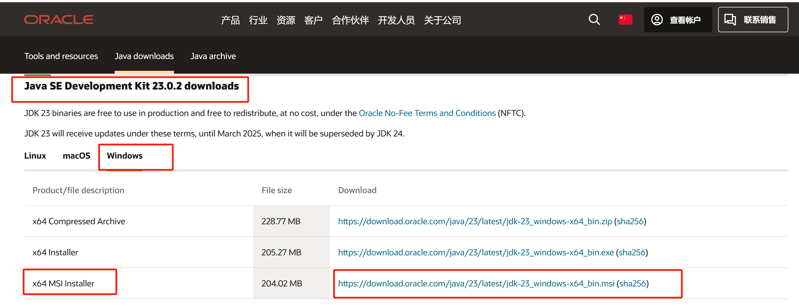
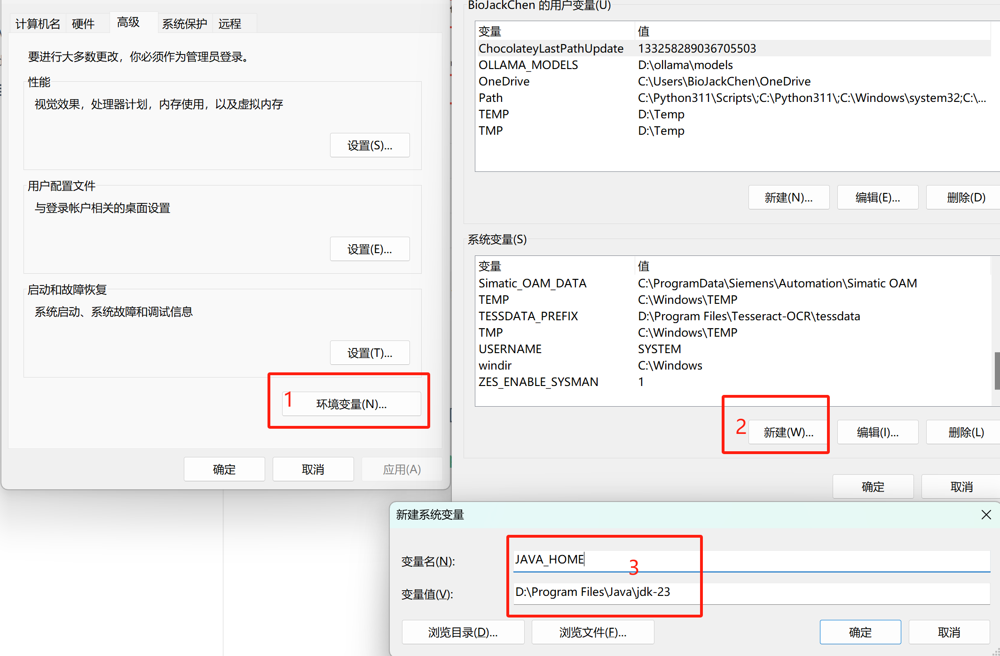
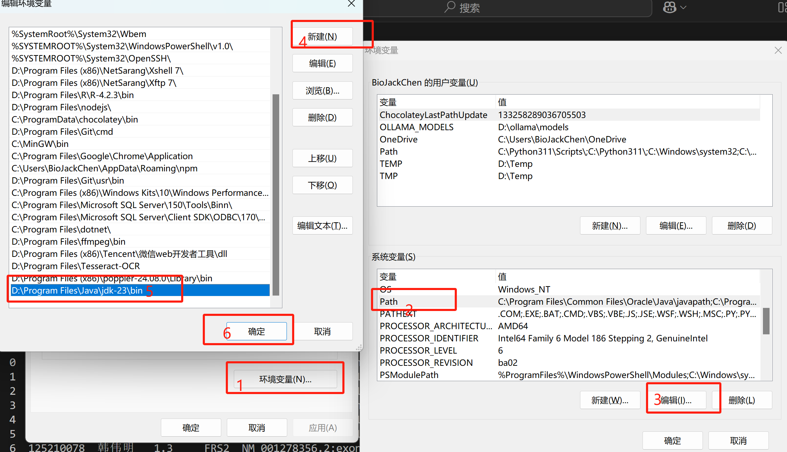
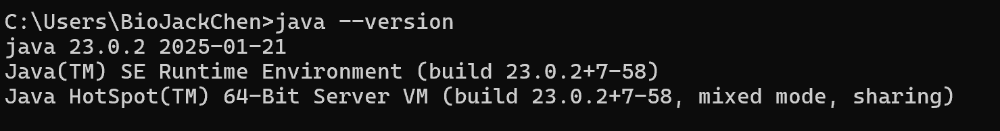

# app逆向

### 配置java环境

#### windows

+ 下载[jdk23](https://www.oracle.com/cn/java/technologies/downloads/)，Windows优先选`x64 MSI Installer`，下载完成后点击安装。

+ 配置环境变量`JAVA_HOMED`，把`JAVA_HOME`的`bin`目录附加到系统环境变量`PATH`上。

+ 验证是否安装成功，win+R输入cmd，执行`java --version`，出现下方数据即为成功。

### 工具推荐

+ 爱盘 - 在线破解工具包：https://down.52pojie.cn/Tools/Android_Tools/

+ Apktool：https://apktool.org/，基本文档https://apktool.org/docs/build
+ smali2java：https://pan.baidu.com/s/1Cr1E4Cw7d_djRkU92R12kQ

### 基本文件结构

+ `assets`：静态资源文件
+ `lib`：库文件
+ `META-INF`：签名文件
+ `res`：编译资源文件
+ `AndroidManifest.xml`：配置清单文件
+ `classes.dex`：核心代码文件
+ `resources.arsc`：资源映射文件

### 开源安卓模拟器

https://github.com/barry-ran/QtScrcpy